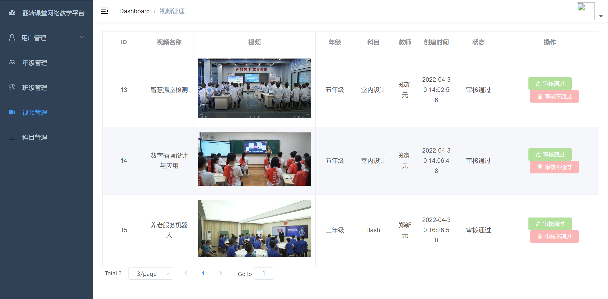

# 基于SpringCloud 在线教学平台

## 项目介绍
整个项目基于SpringCloud alibaba + vue-element-ui 整合开发的在线教学平台。
- 以SpringFramework为核心容器
- 以SpringMVC为模型视图控制器
- Mybatis为数据控制层
- Redis作为缓存
- JWT+Gateway网关鉴权
- 注册中心、配置中心使用Nacos

## 功能列表
### 后台管理员：
- 用户管理：用于管理后台系统的用户，包括管理员，教师与学生用户增删改查
- 权限管理：维护管理员对系统的权限
- 专业与班级管理：维护班级与专业分配信息
- 视频审核：审核教师端上传的视频，审核通过后即可在学生端展示
### 教师
- 视频管理：上传视频至平台，待后台管理员审核通过后展示到学生端
- 发布小测：对小测进行增删改查，发布小测至学生端
- 成绩分析：待学生完成小测内容后，可以根据学生、学生、小测三个维度来生成可视化图表
- 成员信息：查看负责班级的学生信息
### 学生
- 观看视频：查看教师端发布的视频
- 完成小测：完成教师端发布的小测内容，查看已完成与完成的小测内容
- 查看成绩：查看已完成的成绩，观看错题与解析

## 技术选型
|技术|说明| 官网|
|----|----|----|
|spirng-cloud-alibaba|核心框架|https://spring.io/projects/spring-cloud-alibaba/|
|SpinrMVC|视图框架|http://docs.spring.io/spring/docs/current/spring-framework-reference/htmlsingle/#mvc|
|myBatis|持久层框架|http://www.mybatis.org/mybatis-3/zh/index.html|
|Alibaba nacos|注册和配置中心|https://github.com/alibaba/nacos/|
|Redis|分布式缓存数据库|	https://redis.io/|
|SpringCloud OpenFeign|服务调用|https://spring.io/projects/spring-cloud-openfeign/|
|Spring Cloud Gateway|服务网关|https://spring.io/projects/spring-cloud-gateway/|
|SLF4J	|日志组件|	http://www.slf4j.org/|
|Maven|项目构建管理|http://maven.apache.org/|
|认证组件|JWT|http://jwt.io|
|安全框架|SpringSecurity|	https://spring.io/projects/spring-cloud-security/|
|搜索工具|ElasticSearch|https://www.elastic.co/cn/elasticsearch/|

## 项目部分截图
### 权限管理

### 视频审核

### 上传小测

### 成绩分析

### 考试成绩

### 在线考试

